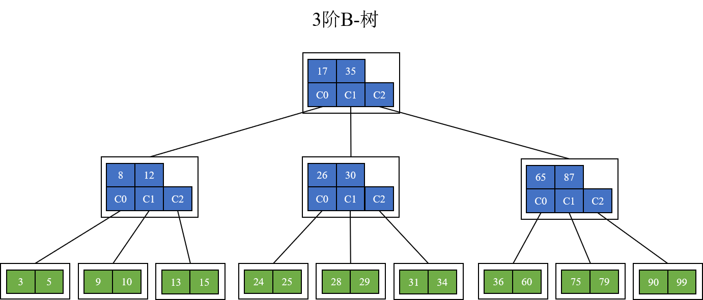
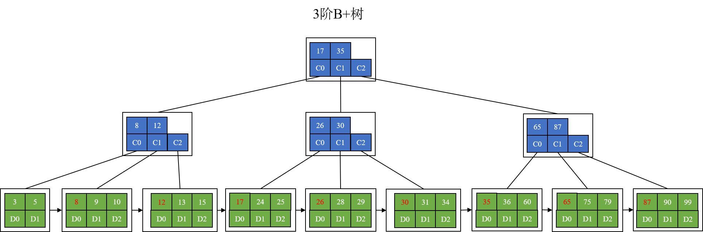

# B Tree

性质
- 内部结点：key个数 `[上(m/2)-1,m-1]`，孩子数`[上(m/2), m]`，key个数+1=孩子数
- 根节点：key个数 `[1,m-1]`，孩子数`[2,m]`，key个数+1=孩子数
- B树的所有叶子结点都位于同一层

对比
- 对比B+树：B树的key和value放到了每一个结点中；B+树key在每个结点中，value在叶子结点中
- 对比于AVL：B树是m分支平衡搜索树，AVL是2分支平衡搜索树
# B+ Tree

对比B树的优势
- 区间查找：B+树进行区间查找时更加快速，找到左边界后根据叶子结点的next指针查找。B树需要进行中序遍历
- IO次数更少：内部结点可以存储更多的关键字，B+树更矮
- IO次数稳定：查询所有关键字的磁盘 I/O 次数都一样，查询效率稳定。

性质
- 内部结点key数量+1=孩子指针数量。叶子结点key数量=记录数量
- 内部结点key个数：`[下(m/2),m-1]`。孩子数`[下(m/2), m]`。key数量+1=孩子指针数量
- 根节点key个数：`[1,m-1]`。孩子数`[2,m]`。key数量=数据索引指针数量
- 叶子结点已经排好序，叶子结点包含全部关键字，叶子结点指向记录
- 有一指针指向最左侧叶子结点，这样所有叶子结点连成一串

本算法实现
- InnerNode: 内部结点；LeafNode: 叶子结点
- 下层内部结点不包含上层内部结点的key值。内部结点key都在叶子结点中
- 内部结点key存在于右子树最左叶子结点的第0个key。
- 上层结点key出现在右侧key下方的子树中，右子树最左侧的叶子结点的第0个key
- 每一层内部结点的key是其"右子结点"的"最左叶子结点"的"第0个key"
- 内部结点key一定出现在叶子结点中，不会出现在下层结点中
- 内部结点含有keys和children。叶子结点含有keys和data
# B* Tree
todo